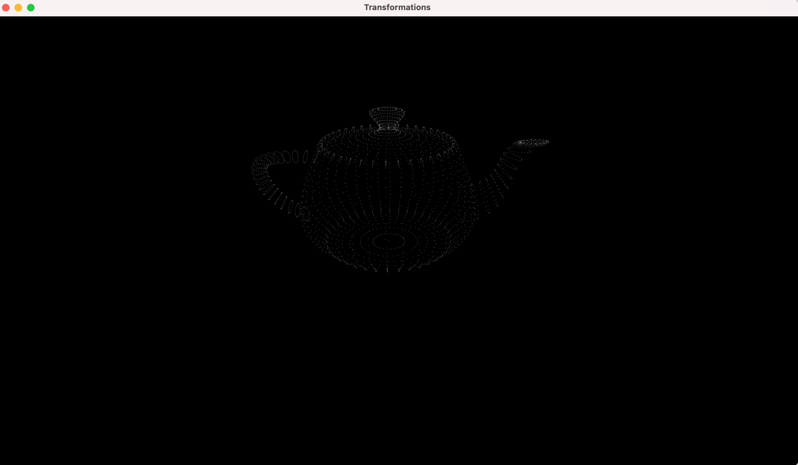
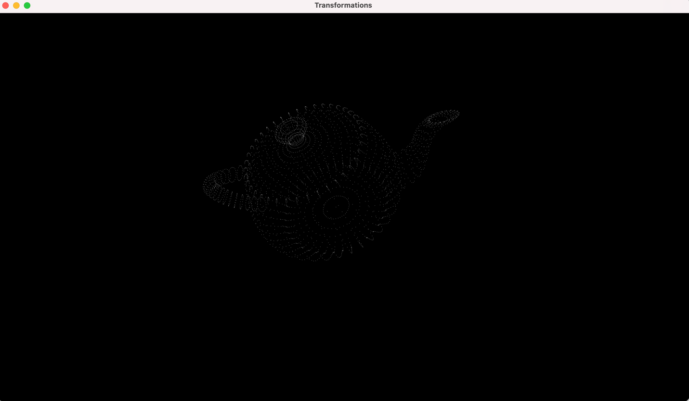
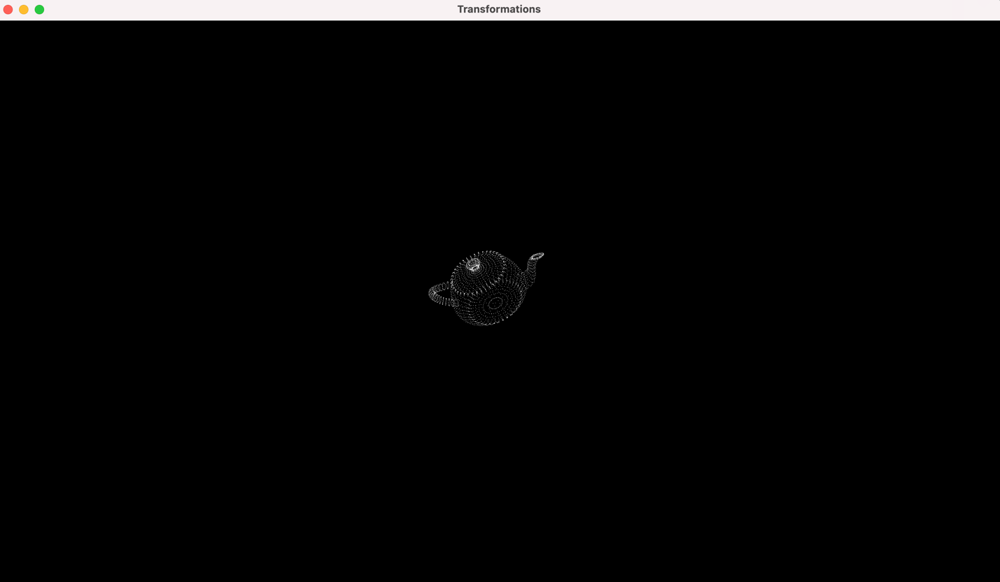
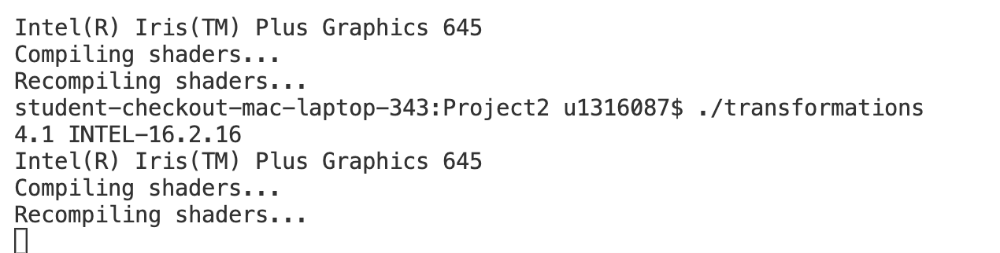

Project 2

Initial Rendering of the teapot centered in the window using the bounding box

Rotation using left mouse click and drag along x-axis/y-axis

Zoom using right mouse click and drag along y-axis

Recompiling Shaders

Implementation

1. The program initializes GLFW and uses it to create a window of a specified size with an OpenGL context.
2. GLEW is initialized and used to get the required OpenGL extensions for the hardware.
3. GLFW callbacks were setup to handle input from keyboard key press, mouse button clicks and mouse cursor movements.
4. The Utah Teapot mesh was loaded from the .obj file into a TriMesh Object.
5. The bounded box of the mesh was computed which was then used to calculate the centre of the object.
6. A Vertex Array Object was created and bound.
7. A Vertex Buffer Object was created and bound. The teapot mesh vertices were stored in the buffer.
8. The vertex and fragment shaders were compiled and added to a program.
9. In the main loop
  1. The Transformation Matrix was calculate based on the X,Y rotation and camera Z distance from the object. The Transformation Matrix was cascaded with a View and Projection Matrix to get the Perspective correction.
  2. The MVP Matrix was passed to the vertex shader as a uniform parameter
  3. The draw call to draw the vertices in the VBO is executed.
  4. Update the transformation matrix variables based on the mouse button/curson callback events.

Additional functionalities beyond project requirements

1. Incase recompiling shaders fails, the program will continue execution using the previously compiled shaders.

How to use your implementation

1. Compile the transformations.cpp file, cyCodeBase must be present in the include path

clang++ -std=c++11 -stdlib=libc++ -arch x86\_64 -o transformations transformations.cpp -lglfw -lglew -framework OpenGL -I/Users/u1316087/Downloads/homebrew/include/ -L/Users/u1316087/Downloads/homebrew/lib/

1. Run the executable

./transformations teapot.obj

1. Controls

The mouse left button when pressed enables rotating the Teapot object in the left and right direction.

The mouse right button when pressed enables zooming in/out of the camera when moving the mouse in the y-axis.

What operating system and compiler you used
 Operating System: macOS 11.3 Big Sur

GLFW version: 3.3.6

GLEW version: 2.2.0\_1

Compiler:
 Apple clang version 12.0.5 (clang-1205.0.22.11) Target: x86\_64-apple-darwin20.4.0

External libraries and additional requirements to compile the project.

cyCodeBase, GLFW and GLEW are required
